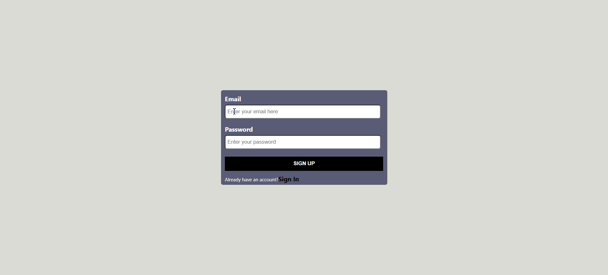
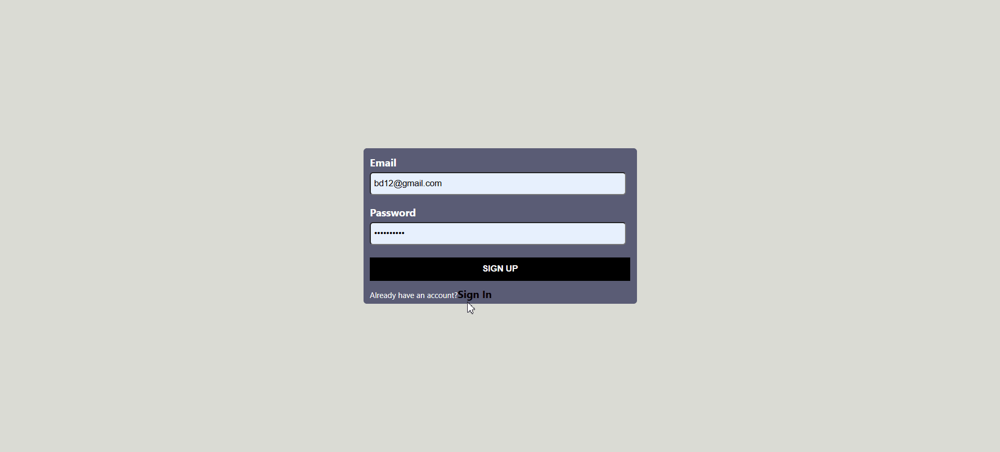
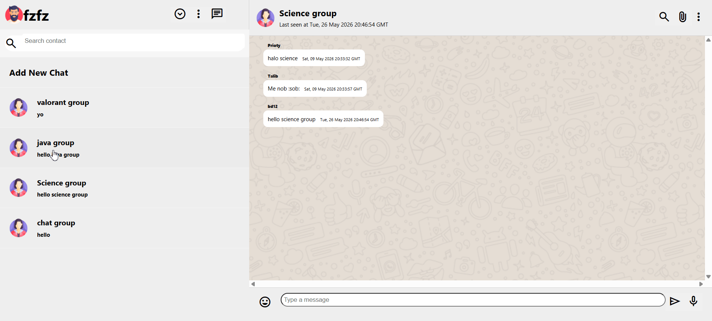

# firechat-qa 💬


A real-time chat application built with React and Firebase, featuring live messaging, authentication, and presence tracking.

🔗 **[Live Demo](https://firechat-qa.netlify.app)**

---

## Screenshots

### Sign Up



### Sign In



### Real-time Updates



## Features

- 🔐 Email/password authentication (sign up, log in, log out)
- 💬 Real-time messaging powered by Firestore
- 🟢 Online/offline presence — last seen timestamp updates live
- 📋 Last message preview in chat list
- ⚡ Instant UI updates via React Context API

---

## Tech stack

| Layer        | Technology                              |
| ------------ | --------------------------------------- |
| Frontend     | React 18, React Router DOM, Context API |
| Backend / DB | Firebase (Firestore, Authentication)    |
| Testing      | Playwright (E2E, cross-browser)         |
| Hosting      | Netlify                                 |

---

## Testing

This project includes **33 end-to-end tests** written with [Playwright](https://playwright.dev/), running across Chromium, Firefox, and WebKit.

**Test coverage:**

- Register page loads correctly
- Register fails with empty fields
- Login page navigation via Sign In link
- Login page loads with correct fields
- Login succeeds with valid credentials
- Login fails with wrong password
- Login fails with empty email
- Login fails with empty password

**Run tests locally:**

```bash
npx playwright test
```

**Run with UI report:**

```bash
npx playwright test --reporter=html
```

---

## Getting started locally

```bash
git clone https://github.com/farzana-prioty/firechat-qa.git
cd firechat-qa
npm install
```

Create a `.env` file in the root with your Firebase config:

```
REACT_APP_API_KEY=your_key
REACT_APP_AUTH_DOMAIN=your_project.firebaseapp.com
REACT_APP_PROJECT_ID=your_project_id
REACT_APP_STORAGE_BUCKET=your_project.appspot.com
REACT_APP_MESSAGING_SENDER_ID=your_sender_id
REACT_APP_APP_ID=your_app_id
```

Then run:

```bash
npm start
```

App runs at `http://localhost:3000`

---

## Project structure

```
src/
├── components/       # Reusable UI components
├── context/          # React Context for global state
├── firebase/         # Firebase config and helpers
├── pages/            # Route-level page components
└── App.js
tests/
└── auth.spec.js      # Playwright E2E test suite
```

---

## Roadmap

- [ ] Bug report documentation
- [ ] GitHub Actions CI pipeline
- [ ] Image/file sharing in chat
- [ ] Group chats
- [ ] Message read receipts

---

## Author

**Farzana Prioty** — [GitHub](https://github.com/farzana-prioty)
